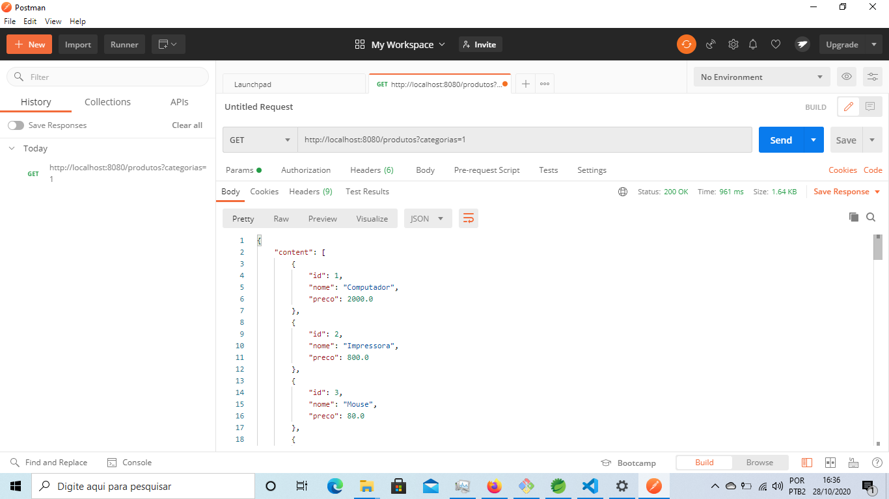
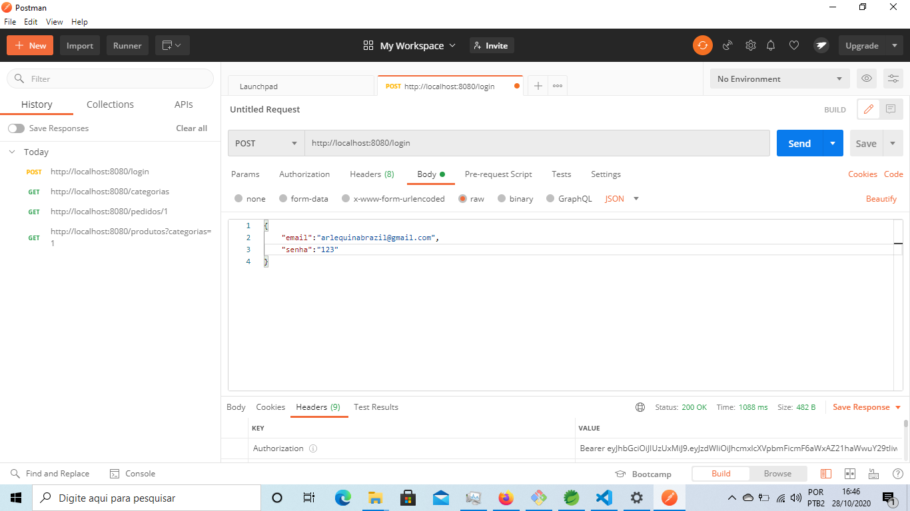
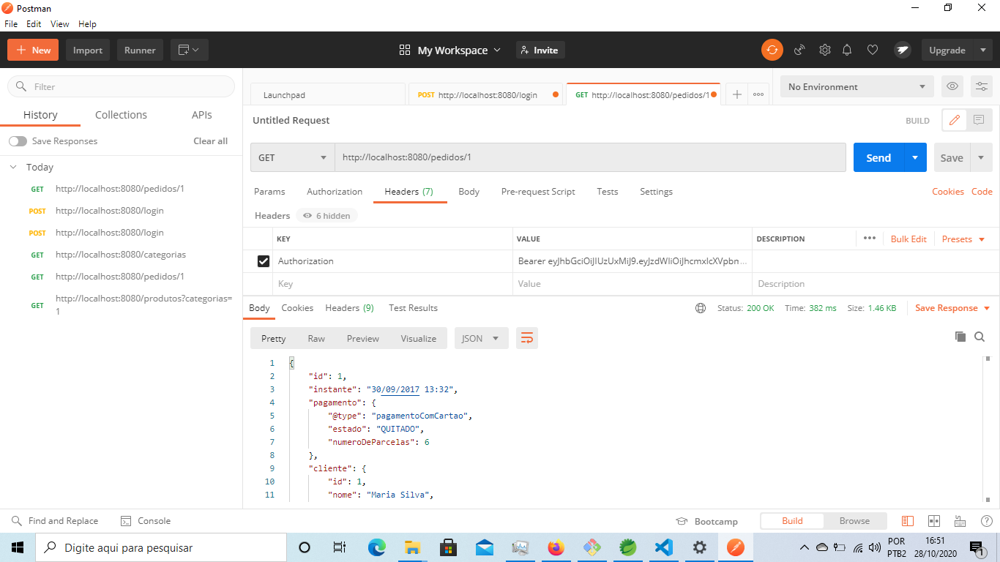

# Loja virtual

> Backend de uma loja virtual.

## Tecnologias usadas no Projeto

![java]
![spring]
![aws]
![jwt]
![thymeleaf]

## Antes de utilizar

Tenha instalado o [JDK](https://www.oracle.com/br/java/technologies/javase/javase-jdk8-downloads.html) e as variáveis _JAVA_HOME_, _CLASSPATH_ e _PATH_ configuradas.

## Como abrir o projeto

O projeto pode ser aberto pelo [**STS(Spring Tools Suite)**](https://spring.io/tools) na opção _File - Open Projects from File System_.

## Execução

**STS**

### Baixando as dependências

Normalmente, o STS baixa as dependências automaticamente ao abrir o projeto, mas se isso não acontecer, clique com botão direito sobre o projeto, vá na opção _Maven_ e depois em _Update Project_.

Para executar clique com botão direito sobre o projeto e escolha _Run as - Spring Boot App_ . A partir daí os endpoints que não precisam de autenticação já podem ser acessados tanto pelo brownser como pelo Postman. Como por exemplo: _http://localhost:8080/produtos?categorias=1_



Para acessar endpoints que precisam de autenticaçao, faça:

Uma requisição ao endpoint _http://localhost:8080/login_ e no corpo da requisição coloque algum usuário cadastrado, exemplo:



Após isso vai ser retornado um token. Copie o token e cole ele em um campo chamado _Authorization_, veja:



O projeto também pode ser executado diretamente do cmd usando o maven do próprio projeto. Acesse o diretório raiz do projeto e entre com:

**Windows**

```
mvnw.cmd spring-boot:run
```

**Linux**

```
mvnw spring-boot:run
```

## Configurando DB

### Modo Test

Para utilizar no modo test não é necessário ter db instalado, configure o arquivo _src/main/resources/application.properties_ e acrescente a linha _spring.profiles.active=test_. Acesse a URL _localhost:8080/h2-console_ e na tela de entrada do H2 mude o campo _JDBC URL_ para _jdbc:h2:mem:testdb_. Clique em connect e já poderá ter acesso ao banco de dados preenchidos com dados de testes.

### Modo desenvolvimento ou produção

Para utilizar no modo de produção ou desenvolvimento, configure o arquivo _src/main/resources/application.properties_ e acrescente _spring.profiles.active=prod_ ou _spring.profiles.active=dev_. Instale o mysql e crie uma base de dados de nome _curso_spring_,
depois configure as credenciais de acesso(usuário e senha) no arquivo _.properties_ correspondente.

## Onde me encontrar?

-Twitter – [@RapazComum6](https://twitter.com/RapazComum6)
-E-mail - malkon.inf@gmail.com
-Linkedin - [Malkon Faria](https://www.linkedin.com/in/malkon-faria-1843b81a7/)

<!-- Markdown link & img dfn's -->

[java]: https://img.shields.io/badge/Java-Java%201.8-green
[spring]: https://img.shields.io/badge/spring--boot-2.1.13-green
[aws]: https://img.shields.io/badge/Amazon-AWS-brightgreen
[jwt]: https://img.shields.io/badge/Token-JWT.IO-red
[thymeleaf]: https://img.shields.io/badge/Template-Thymeleaf-yellowgreen
